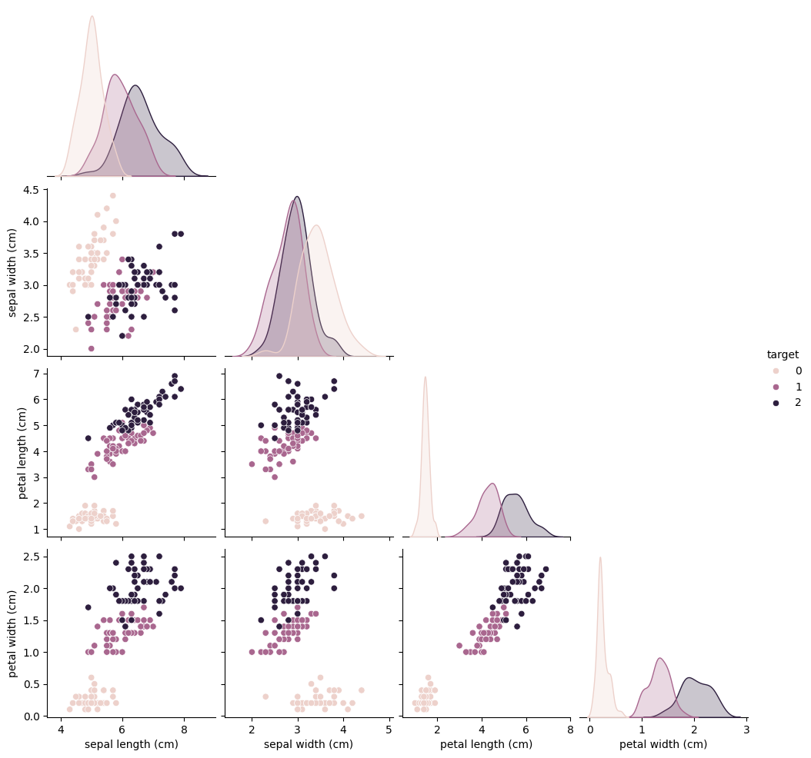
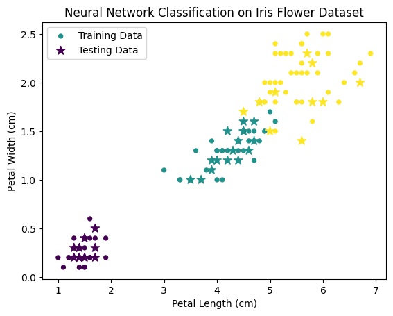

# Neural Networks Classification with Scikit-Learn
This code classifies the Iris Dataset with Scikit-Learn Neural Networks.

The Iris Dataset contains three types of flowers: Setosa, Versicolour, and Virginica. 
The features contain the sepal length, sepal width, petal length, and the petal width. This data is used to classify a given flower into a certain type.

As shown in the graph above, the petal length and petal width have the most correlation with the type of flower, so they were chosen to be usen in the graph (so the difference could be seen easily).

After loading the data, it tested for which option of the number of neurons in each layer and how many layers would be the best. 
Scikit-Learn did this by testing on the training data and seeing which option brings the most accuracy.
After finding the right algorithm, training, and testing (making a prediction) I made a graph which compares the prediction of the testing data and the training data with it's actual target.

